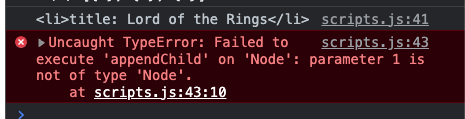

# DOM 101 Lab

You will be writing some functions in JavaScript that will manipulate the DOM.

## Objectives 

- DOM manipulation
## Repo Instructions

- **Fork** this repo to your account by clicking on the **fork** Button at the top of this page. 


*A **fork** is a copy of this repository. This forked repository will appear on your github account.*

- Find the repository on *YOUR* account (ie yourUserName/js-lab-DOM-101) and click on the green `Code` button at the top of the page.


- Copy the path in the dialogue box
- Navigate to a location on **your local computer in VSCode** where you keep your homework 
- Clone this repository by typing the following command in your terminal

```
clone [`path that you just copied`]
```

## Task Instructions

- Navigate into the folder titled `js-lab-DOM-101`
- Use `Live Server` to run `index.html`.
- Manipulate the DOM using the `scripts.js`.
```
//hint
Inspect the page to see what is happening in the elements and the console.
```


# Tasks
## 1. Select the DOM Elements
Using JavaScript, select the elements `title` and `center`.
- use `document.getElementById`
To observe this has worked, `console.log` these elements.

## 2. Manipulate these elements

Add your name to the title element.
 - use the variable name for the element and `.innerHTML` to add `[your name]'s Awesome Site`.

Using JS, create a `h3` and an `unordered list` to the center div.
- Add `My Book List` as the inner text to the `h3`.
- Add an `id` of "bookList" to the unordered list.
- Append both of these to the `center` div.

Near the top of your JS file, make a global variable called `books` that is an array.  In the first index of  the array, make an object that contain `title` and `author`.  For good measure, `console.log` the books.


```js
//example
const books = [
  {title: "Lord of the Rings",
  author: "J.R.R. Tolkien"
  }
  ]
```

## 3. Using Template literals (Template Strings)

[MDN Docs](https://developer.mozilla.org/en-US/docs/Web/JavaScript/Reference/Template_literals)

- Using a template literal, create a `<li>` with the title from our books array. (`console.log` it for good measure).
- Append this to our `bookList`.

Did the `.appendChild` it work??


Let's look at the error.


Why is our literal not an actual Node?
`hint - what data type is it`

## 4. Lets MAP it!!!

 - First, add two more books to your book array.
 - Now, refactor your code (or comment out) the `book` template literal variable.
 - Using the `map()` array method, loop through the array of books and populate our `bookList` with our list.
 > note: to remove the `,` between your list items, use `.join('')`

NOW!  Add some books to the array and watch it add to the list!
